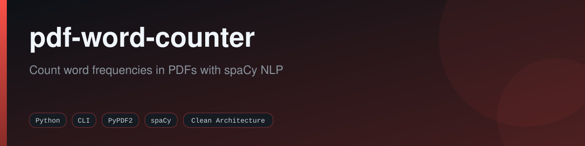
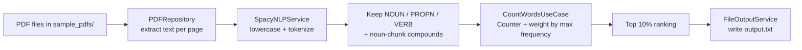

<div align="center">



[](https://github.com/fabricioguidine/pdf-word-counter/actions/workflows/ci.yml)
[](https://codecov.io/gh/fabricioguidine/pdf-word-counter)
[](LICENSE)
[](https://www.python.org)
[](https://github.com/astral-sh/ruff)
[](#)

</div>

> Count word frequencies in PDF files using spaCy NLP, built on Clean Architecture.

This CLI utility reads every PDF in a folder, extracts meaningful single words (nouns, proper nouns, verbs) and multi-word noun chunks with spaCy, counts how often each term occurs across all documents, and writes a weighted ranking of the most frequent terms to a text file.

## Table of Contents

- [Features](#features)
- [How it works](#how-it-works)
- [Requirements](#requirements)
- [Installation](#installation)
- [Usage](#usage)
- [Project structure](#project-structure)
- [License](#license)

## Features

- Reads every `.pdf` file found in the input folder.
- Extracts text from each page with PyPDF2.
- Uses spaCy to keep meaningful tokens: nouns, proper nouns, and verbs longer than two characters.
- Detects compound terms from spaCy noun chunks (multi-word phrases such as "software testing").
- Counts term frequency across all processed PDFs with `collections.Counter`.
- Assigns each term a relative weight normalized to the highest frequency observed.
- Reports the top 10% most frequent terms (at least one), ranked, with count and weight.
- Writes per-file word counts and the ranking to `output.txt`.
- Organized in Clean Architecture layers (domain, application, infrastructure, presentation).

## How it works



The pipeline is wired in `src/presentation/cli.py`. `PDFRepository.extract_text` concatenates the text of every page, `SpacyNLPService.extract_words` lowercases the text and filters tokens by part of speech, `CountWordsUseCase.execute` builds the frequency table and computes per-term weight relative to the maximum frequency, and `FileOutputService` writes the result to disk.

## Requirements

- Python 3.10 or newer.
- Runtime dependencies (see `requirements.txt`):
  - `PyPDF2==3.0.1`
  - `spacy==3.8.5`
- A spaCy language model. The default is `en_core_web_sm`; a Portuguese model (`pt_core_news_sm`) is also supported.

## Installation

```powershell
git clone https://github.com/fabricioguidine/pdf-word-counter.git
cd pdf-word-counter

python -m venv .venv
.venv\Scripts\Activate.ps1

pip install -r requirements.txt
python -m spacy download en_core_web_sm
```

For Portuguese text, download the Portuguese model instead:

```powershell
python -m spacy download pt_core_news_sm
```

## Usage

1. Place the PDF files you want to analyze in the `sample_pdfs/` folder.
2. Run the tool:

```powershell
python main.py
```

Equivalently, you can run the CLI module directly:

```powershell
python -m src.presentation.cli
```

3. Read the results in `output.txt`.

The tool takes no command-line arguments; it reads from `sample_pdfs/` and writes to `output.txt` next to the project root. The input folder, output file, spaCy model, and top-percentage cutoff are configured in `PDFWordCounterCLI` (defaults: `sample_pdfs`, `output.txt`, `en_core_web_sm`, `0.10`).

The generated `output.txt` contains one line per PDF with its useful-word count, the total number of unique useful words, and the ranking of the top terms:

```
file1.pdf: 1234 palavras úteis
file2.pdf: 567 palavras úteis

Palavras únicas úteis: 890

Top 89 palavras mais frequentes (com pesos):

01. software testing        →   45x | peso: 1.00
02. quality assurance       →   32x | peso: 0.71
03. test case               →   28x | peso: 0.62
```

## Project structure

```
pdf-word-counter/
├── main.py                     # Entry point -> src.presentation.cli.main
├── src/
│   ├── domain/                 # Entities, repository and service interfaces
│   │   ├── entities/           # Word, WordFrequency, WordStatistics
│   │   ├── repositories/       # IPDFRepository
│   │   └── services/           # INLPService, IOutputService
│   ├── application/
│   │   └── use_cases/          # ExtractWordsUseCase, CountWordsUseCase
│   ├── infrastructure/
│   │   ├── repositories/       # PDFRepository (PyPDF2)
│   │   └── services/           # SpacyNLPService, FileOutputService
│   └── presentation/
│       └── cli.py              # PDFWordCounterCLI
├── tests/                      # pytest suite
├── sample_pdfs/                # Input PDF files
├── requirements.txt
├── pyproject.toml
└── LICENSE
```

## License

Released under the [MIT License](LICENSE).
